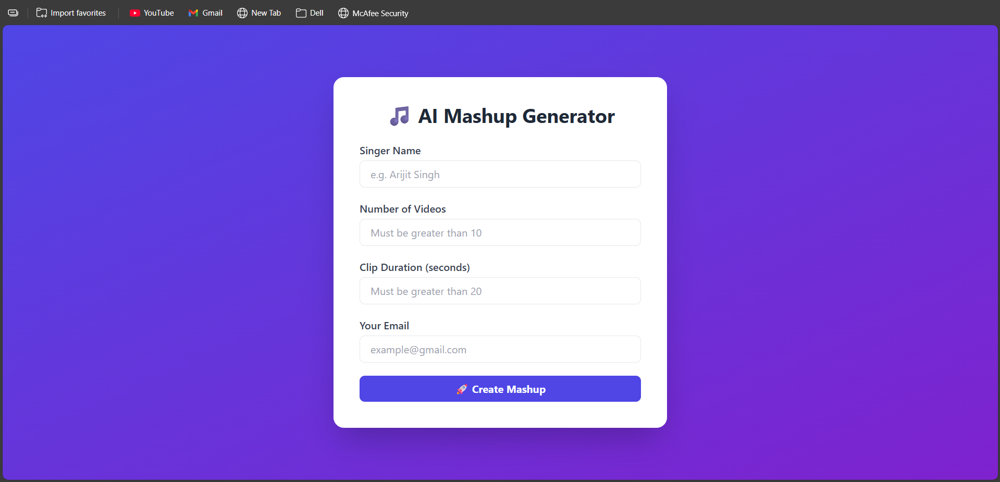
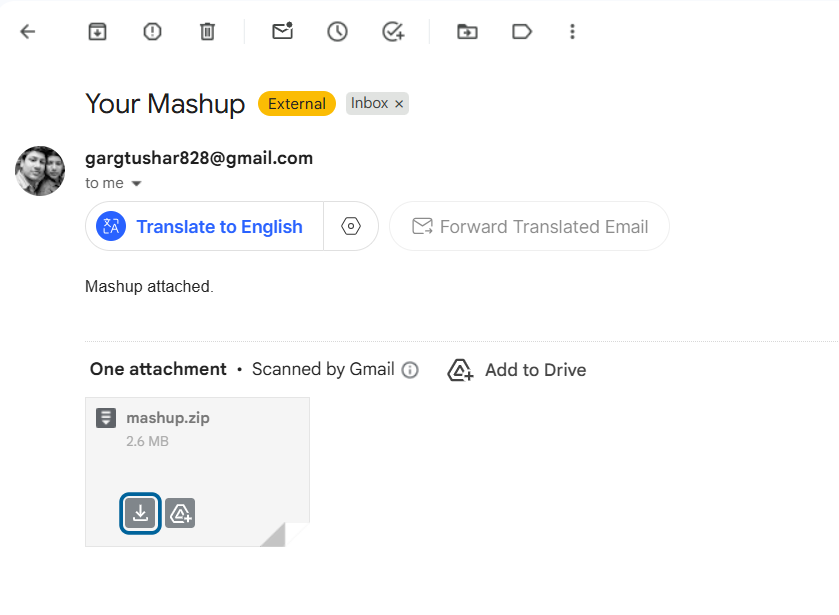

###🎵 AI-Powered Music Mashup Generator

##Overview
A Flask-based web application that automatically generates an audio mashup from YouTube songs of a given singer.
Users provide the singer name, number of videos, clip duration, and their email. The system downloads audio, trims clips, merges them, and sends the final mashup via email.

This project demonstrates *backend system design*, *media processing*, *automation*, and *web integration*.
---
##🚀 Features

- Web interface built using Flask + Tailwind CSS
- Downloads audio from YouTube using yt-dlp
- Extracts and trims audio clips with pydub + ffmpeg
- Merges multiple clips into a single mashup
- Automatically cleans temporary files
- Sends final mashup as ZIP via email
- Uses environment variables for secure credentials

---

🧠 System Architecture

```
User Input (Web Form)
        ↓
Flask Backend Server
        ↓
yt-dlp (Audio Download)
        ↓
Audio Processing (Trim + Merge)
        ↓
Mashup File Generated
        ↓
ZIP Creation
        ↓
Email Delivery to User
```

--- 
## 🛠️ Tech Stack

| **Layer**          | **Tools Used**          |
|--------------------|------------------------|
| Backend            | Flask                  |
| Frontend           | HTML + Tailwind CSS    |
| Video Download     | yt-dlp                 |
| Audio Processing   | pydub, ffmpeg          |
| Email Service      | SMTP (Gmail)           |
| File Handling      | Python OS & Zipfile    |


---
##📁 Project Structure
```
mashup-project/
│── app.py               # Web server and email system
│── mashup_engine.py     # Downloading, trimming, merging logic
│── clean_up.py          # Temporary file removal
│── requirements.txt
│
├── downloads/           # Downloaded audios (auto-cleared)
├── trimmed/             # Trimmed clips (auto-cleared)
├── output/              # Final mashup & zip

```

--- 
##⚙️ Setup Instructions

#-1️⃣ Clone repository
```bash
git clone <your-repo-link>
cd mashup-project
```

#2️⃣ Create virtual environment
```bash 
python -m venv venv
venv\Scripts\activate   # Windows
```


#3️⃣ Install dependencies

```bash
pip install -r requirements.txt
```

#4️⃣ Install FFmpeg
```text
Download ffmpeg and add it to system PATH.
```

#5️⃣ Set Email Credentials (IMPORTANT)

```text
Use Gmail App Password (not your real password).
```
```bash
setx EMAIL_ADDRESS "your_email@gmail.com"
setx EMAIL_PASSWORD "your_16_char_app_password"
```

#6️⃣ Run Application
```bash
python app.py
```
```text

Open browser at:
```
```bash
http://127.0.0.1:5000
```

---
## 🔄 How It Works

- User enters singer name, video count, duration, and email.
- System downloads the requested number of songs.
- First X seconds of each audio clip are extracted.
- Clips are merged into one mashup.
- Output is zipped.
- ZIP is emailed to the user.
- Temporary files are deleted.

---
## 📸 Screenshots to Include

Add these images in your README:

| **Screenshot**       | **Purpose**                  |
|----------------------|------------------------------|
| Web UI page          | Shows frontend design         |
| Terminal processing  | Shows backend pipeline        |
| Email received       | Proof of full system working  |
---

##⚠️ Challenges Faced

-Handling YouTube 403 errors

-Configuring ffmpeg correctly

-Preventing Flask auto-reload crash

-Managing failed downloads gracefully

---
##🔮 Future Improvements

-Add progress bar during processing

-Deploy backend to cloud server

-Support different audio formats
-Allow song preview before merge
---
##🎯 Learning Outcomes

-This project demonstrates:

-Backend web development

-Media processing automation

-File handling pipelines

-Email integration

-Error handling in real systems

--- 
##📷 Project Demonstration

# 🖥️ Web Interface




# 🧠 Backend Processing Logs (Summary)
```text

The following logs demonstrate the successful end-to-end execution of the backend pipeline:

- Flask server started successfully on `http://127.0.0.1:5000`
- User accessed the web interface (`GET /`)
- YouTube videos searched and downloaded using **yt-dlp**
- Audio extracted from downloaded videos and converted to MP3
- Some videos failed to download due to HTTP 403 errors (handled gracefully)
- First X seconds of each audio clip were trimmed
- Multiple audio clips were merged into a single mashup
- Temporary audio files were deleted after processing
- Final mashup was compressed into a ZIP file
- ZIP file was sent successfully to the user via email
- Server responded with success (`POST /create → 200 OK`)

```

#Email Delivery



---
##🎓 Final Student Info Section (Add at bottom)
#👨‍💻 Developed By
```text
Name: Tushar Garg
```
---